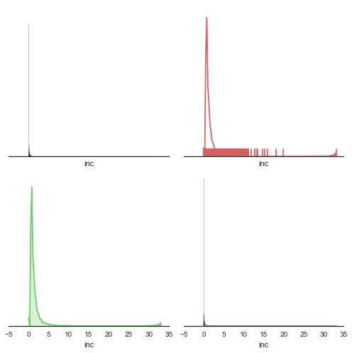
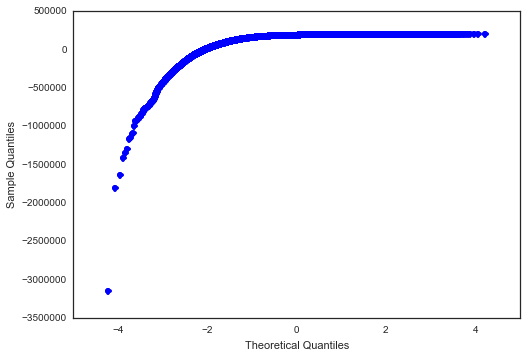
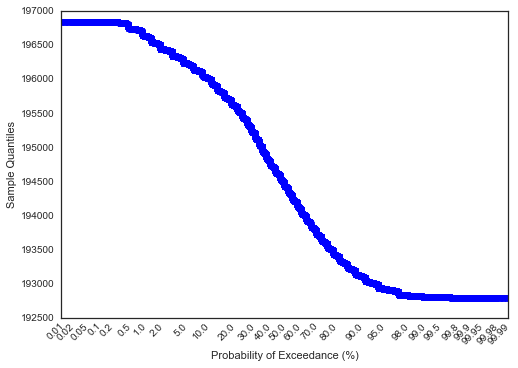
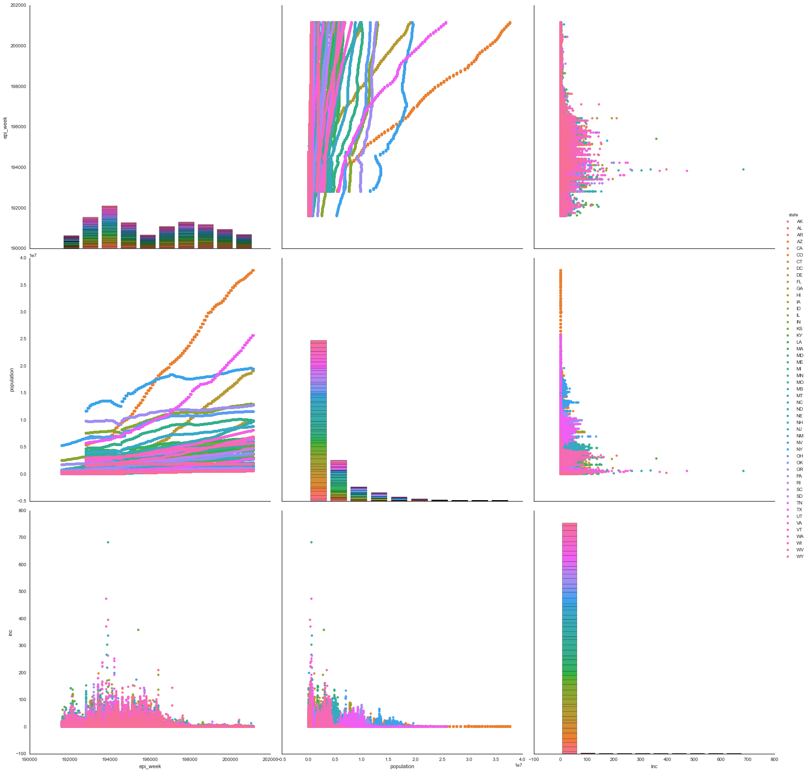
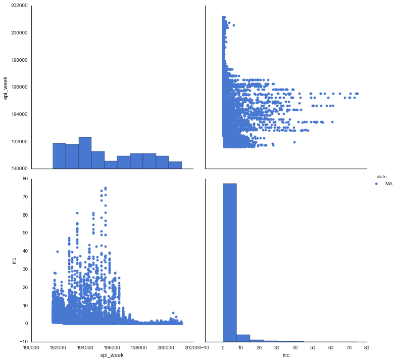
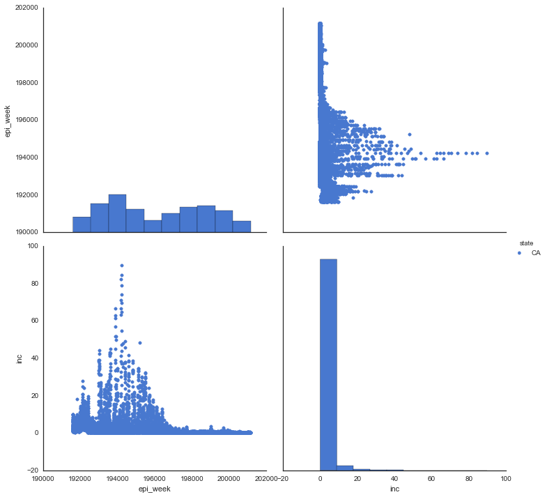
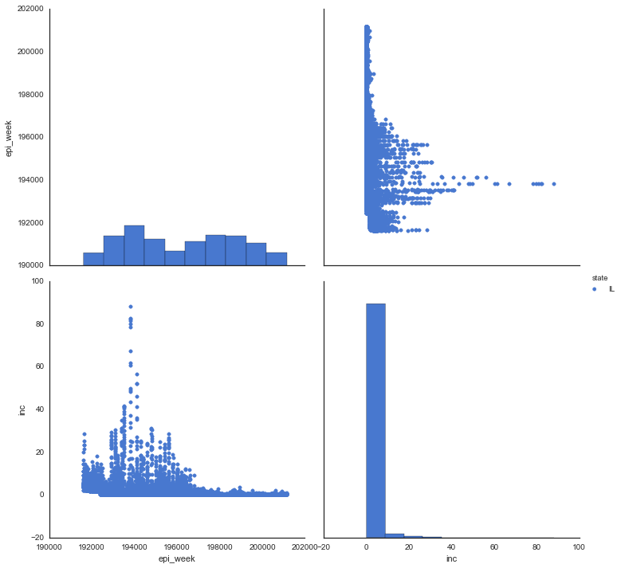
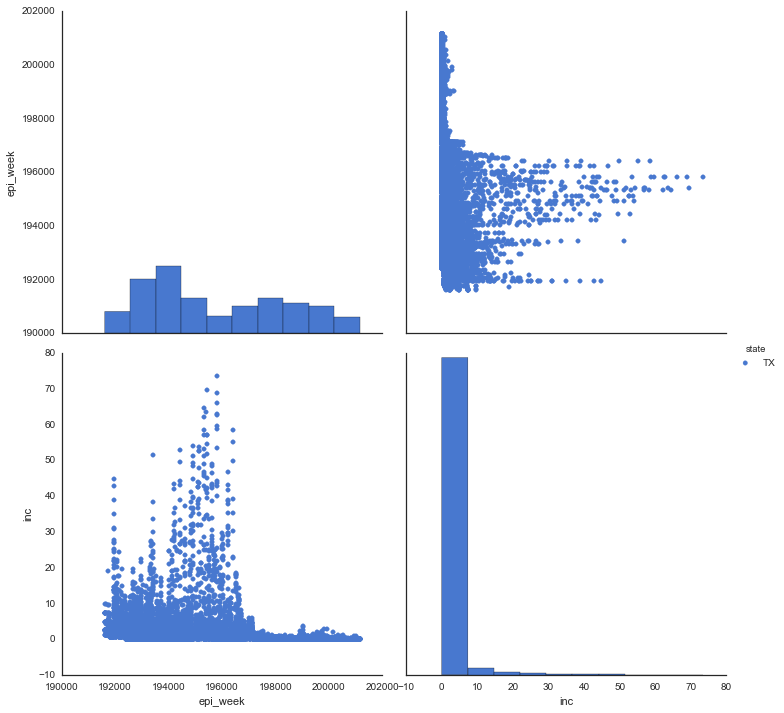

Created on Fri Apr  3 19:31:55 2015

@author: JD Davis

A visual analysis of polio disease rates
from 1888-2013

Most of the data in this set are about diseases that are preventable with vaccination.  These analyses are done for fun and for learning.  A more serious statistical handling of the data would utilize *time-series* analysis and not a ordinary least squares regression.  When time allows I will revise this tutorial.

website for data: https://www.healthdata.gov
Data set : ProjectTyco_Level1

Analysis done in Python 3.4

    import pandas as pd
    import csv

    data_file = "/Users/Work/Desktop/disease.hx.csv"
    with open(data_file, 'r') as csvfile:
        reader = csv.DictReader(csvfile)
        data = list(reader)

    #take a peak at the data set
    
    len(data) # get an idea of number of observations
    
    print ('number of columns', len(reader.fieldnames))

    number of columns 10

    #write a function so you can read in data in smaller chunks
    #useful for larger data sets, and it also memorizes the path for you!
    def dataset(path):
        with open(path, 'r') as csvfile:
            reader = csv.DictReader(csvfile)
            for row in reader:
                yield row

    #find out which diseases are represented
    print (set([row ["disease"] for row in dataset(data_file)]))

    {'MUMPS', 'SMALLPOX', 'PERTUSSIS', 'MEASLES', 'DIPHTHERIA', 'RUBELLA', 'HEPATITIS A', 'POLIO'}

    #look at range of years
    
    print ('first year of observations', min(set([int(row['epi_week']) for row in dataset (data_file)])))
    #looks like starts in epi_week 1916, week 1
    
    #now let's look at the latest date
    print ('last year of observations', max(set(int(row["epi_week"]) for row in dataset(data_file))))

    first year of observations 191601
    last year of observations 201152

    {row ["disease"] for row in dataset(data_file)}
    (['RUBELLA', 'POLIO', 'MEASLES', 'HEPATITIS A', 'DIPHTHERIA', 'PERTUSSIS',
      'SMALLPOX', 'MUMPS'])

    ['RUBELLA',
     'POLIO',
     'MEASLES',
     'HEPATITIS A',
     'DIPHTHERIA',
     'PERTUSSIS',
     'SMALLPOX',
     'MUMPS']

    #now let's do some simple statistical analysis and visualization
           
    import csv
    import matplotlib.pyplot as plt
    
    df = pd.read_csv('/Users/Work/Desktop/disease.hx.csv', index_col='id')                      
    
    #let's look at some summary statistics and do a regression
    df.dtypes #see what the variables are and their data type
    df.describe() #descriptive stats

<table border="1" class="dataframe">
  <thead>
    <tr style="text-align: right;">
      <th></th>
      <th>Unnamed: 0</th>
      <th>epi_week</th>
      <th>number</th>
      <th>population</th>
      <th>inc</th>
    </tr>
  </thead>
  <tbody>
    <tr>
      <th>count</th>
      <td>759467.000000</td>
      <td>759467.000000</td>
      <td>759420.000000</td>
      <td>759467.000000</td>
      <td>759467.000000</td>
    </tr>
    <tr>
      <th>mean</th>
      <td>379734.000000</td>
      <td>196057.747140</td>
      <td>32.759649</td>
      <td>3510385.659389</td>
      <td>1.450848</td>
    </tr>
    <tr>
      <th>std</th>
      <td>219239.382783</td>
      <td>2573.487654</td>
      <td>180.236408</td>
      <td>4644710.023281</td>
      <td>5.432002</td>
    </tr>
    <tr>
      <th>min</th>
      <td>1.000000</td>
      <td>191601.000000</td>
      <td>0.000000</td>
      <td>10008.000000</td>
      <td>0.000000</td>
    </tr>
    <tr>
      <th>25%</th>
      <td>189867.500000</td>
      <td>193832.000000</td>
      <td>0.000000</td>
      <td>554000.000000</td>
      <td>0.000000</td>
    </tr>
    <tr>
      <th>50%</th>
      <td>379734.000000</td>
      <td>195603.000000</td>
      <td>1.000000</td>
      <td>2016000.000000</td>
      <td>0.070000</td>
    </tr>
    <tr>
      <th>75%</th>
      <td>569600.500000</td>
      <td>198238.000000</td>
      <td>10.000000</td>
      <td>4440859.000000</td>
      <td>0.740000</td>
    </tr>
    <tr>
      <th>max</th>
      <td>759467.000000</td>
      <td>201152.000000</td>
      <td>10402.000000</td>
      <td>37691912.000000</td>
      <td>683.060000</td>
    </tr>
  </tbody>
</table>

    #make a new object that has only the POLIO cases
    df2 = df.copy()
    df2
    df3=df2[df2['disease'].isin(['POLIO'])]
    df3
    
    #lastly we'll look at quantiles
    from scipy.stats.mstats import mquantiles
    print ('quantiles:', mquantiles(df.inc))

    quantiles: [ 0.    0.07  0.74]

    #make your first visual
    
    import seaborn as sns
    
    sns.set(style="white", palette="muted")
    f, axes = plt.subplots(2,2, figsize=(7,7), sharex=True)
    sns.despine(left=True)
    b, g, r, p = sns.color_palette("muted", 4)
    sns.distplot(df3.inc, kde=False, color=b, ax=axes[0,0])
    sns.distplot(df3.inc, hist=False, rug=True, color=r, ax=axes[0,1])
    sns.distplot(df3.inc, hist=False, color=g, kde_kws={"shade": True}, ax=axes[1,0])
    sns.distplot(df3.inc, color=p, ax=axes[1,1])
    
    plt.setp(axes, yticks=[])
    plt.tight_layout()

We see that first year for Polio monitoring was 1928 and the last year with
a significant count was 1968. For Polio subset 81531 records exist in the data set.
The maximum incidence ratio during this time period was 33 and minimum
was zero.

    #histogramming the data for Polio
    s = pd.Series(df3.inc)
    pd.value_counts(s) #the data on the frequency of values
    
    df3.describe()

<table border="1" class="dataframe">
  <thead>
    <tr style="text-align: right;">
      <th></th>
      <th>Unnamed: 0</th>
      <th>epi_week</th>
      <th>number</th>
      <th>population</th>
      <th>inc</th>
    </tr>
  </thead>
  <tbody>
    <tr>
      <th>count</th>
      <td>759467.000000</td>
      <td>759467.000000</td>
      <td>759420.000000</td>
      <td>759467.000000</td>
      <td>759467.000000</td>
    </tr>
    <tr>
      <th>mean</th>
      <td>379734.000000</td>
      <td>196057.747140</td>
      <td>32.759649</td>
      <td>3510385.659389</td>
      <td>1.450848</td>
    </tr>
    <tr>
      <th>std</th>
      <td>219239.382783</td>
      <td>2573.487654</td>
      <td>180.236408</td>
      <td>4644710.023281</td>
      <td>5.432002</td>
    </tr>
    <tr>
      <th>min</th>
      <td>1.000000</td>
      <td>191601.000000</td>
      <td>0.000000</td>
      <td>10008.000000</td>
      <td>0.000000</td>
    </tr>
    <tr>
      <th>25%</th>
      <td>189867.500000</td>
      <td>193832.000000</td>
      <td>0.000000</td>
      <td>554000.000000</td>
      <td>0.000000</td>
    </tr>
    <tr>
      <th>50%</th>
      <td>379734.000000</td>
      <td>195603.000000</td>
      <td>1.000000</td>
      <td>2016000.000000</td>
      <td>0.070000</td>
    </tr>
    <tr>
      <th>75%</th>
      <td>569600.500000</td>
      <td>198238.000000</td>
      <td>10.000000</td>
      <td>4440859.000000</td>
      <td>0.740000</td>
    </tr>
    <tr>
      <th>max</th>
      <td>759467.000000</td>
      <td>201152.000000</td>
      <td>10402.000000</td>
      <td>37691912.000000</td>
      <td>683.060000</td>
    </tr>
  </tbody>
</table>

You will see that time, i.e. epi_week is strongly associated with incidence, 
but there is a fairly high skew rate (9.447) and Kurtosis is very high (209.747).
Thus its inappropriate to use a linear regression with the data in this format.

    import numpy as np
    import statsmodels.api as sm
    
    x = df3.epi_week
    y = df3.inc
    results = sm.OLS(y, x).fit()
    print (results.summary()) 

                                OLS Regression Results                            
    ==============================================================================
    Dep. Variable:                    inc   R-squared:                       0.065
    Model:                            OLS   Adj. R-squared:                  0.065
    Method:                 Least Squares   F-statistic:                 5.310e+04
    Date:                Sun, 31 May 2015   Prob (F-statistic):               0.00
    Time:                        00:07:57   Log-Likelihood:            -2.3634e+06
    No. Observations:              759467   AIC:                         4.727e+06
    Df Residuals:                  759466   BIC:                         4.727e+06
    Df Model:                           1                                         
    Covariance Type:            nonrobust                                         
    ==============================================================================
                     coef    std err          t      P>|t|      [95.0% Conf. Int.]
    ------------------------------------------------------------------------------
    epi_week     7.33e-06   3.18e-08    230.431      0.000      7.27e-06  7.39e-06
    ==============================================================================
    Omnibus:                  1492160.916   Durbin-Watson:                   1.292
    Prob(Omnibus):                  0.000   Jarque-Bera (JB):      15747391774.192
    Skew:                          15.167   Prob(JB):                         0.00
    Kurtosis:                     707.780   Cond. No.                         1.00
    ==============================================================================
    
    Warnings:
    [1] Standard Errors assume that the covariance matrix of the errors is correctly specified.

    #let's look at the data in a probability plot to see what might be the problem
    import statsmodels.api as sm
    from matplotlib import pyplot as plt
    mod_fit = sm.OLS(df3.epi_week, df3.inc).fit()
    res = mod_fit.resid # residuals
    fig = sm.qqplot(res)
    plt.show()
    
    #the problem with a linear regression model may be that at about -1 quantiles
    #the samples flatten out, i.e. there is little variability...again this is due to the advent of vaccination most likely

    pp_x = sm.ProbPlot(x, fit=True)
    x = df3.epi_week
    y = df3.inc
    pp_x = sm.ProbPlot(x, fit=True)
    pp_y = sm.ProbPlot(y, fit=True)
    fig2 = pp_x.probplot(exceed=True)
    
    #fig 2 above suggests we should select dates between 1925 and 1970
    #if we want to perform a linear regression, however for this analysis
    #probably not a meaningful assessment

Let's do one last visualization to look at the incidence over time by, 
state, week and population. The new visual assessment shows that incidence of polio grew before it was virtually eliminated by 1988.  Since we do see some variability by state we might want to subset again by region of the country.  However that's another lesson!  For this lesson we will compare Texas (south) to California (west) to Massachusetts(east), to Illinois(north).

    sns.pairplot(df3, hue="state", vars=('epi_week', 'population', 'inc'),
                 size=7.5)
                 

    <seaborn.axisgrid.PairGrid at 0x192207be0>

    df3 = df.copy()
    df3
    df.south=df3[df3['state'].isin(['TX'])]
    df.south
    
    df.north = df3[df3['state'].isin(['IL'])]
    df.west = df3[df3['state'].isin(['CA'])]
    df.east = df3[df3['state'].isin(['MA'])]
    df.east

<table border="1" class="dataframe">
  <thead>
    <tr style="text-align: right;">
      <th></th>
      <th>Unnamed: 0</th>
      <th>disease</th>
      <th>epi_week</th>
      <th>loc</th>
      <th>state</th>
      <th>number</th>
      <th>population</th>
      <th>inc</th>
      <th>loc_type</th>
    </tr>
    <tr>
      <th>id</th>
      <th></th>
      <th></th>
      <th></th>
      <th></th>
      <th></th>
      <th></th>
      <th></th>
      <th></th>
      <th></th>
    </tr>
  </thead>
  <tbody>
    <tr>
      <th>42</th>
      <td>42</td>
      <td>HEPATITIS A</td>
      <td>196601</td>
      <td>MASSACHUSETTS</td>
      <td>MA</td>
      <td>10</td>
      <td>5535000</td>
      <td>0.18</td>
      <td>STATE</td>
    </tr>
    <tr>
      <th>63</th>
      <td>63</td>
      <td>HEPATITIS A</td>
      <td>196602</td>
      <td>MASSACHUSETTS</td>
      <td>MA</td>
      <td>10</td>
      <td>5535000</td>
      <td>0.18</td>
      <td>STATE</td>
    </tr>
    <tr>
      <th>109</th>
      <td>109</td>
      <td>HEPATITIS A</td>
      <td>196603</td>
      <td>MASSACHUSETTS</td>
      <td>MA</td>
      <td>17</td>
      <td>5535000</td>
      <td>0.31</td>
      <td>STATE</td>
    </tr>
    <tr>
      <th>160</th>
      <td>160</td>
      <td>HEPATITIS A</td>
      <td>196604</td>
      <td>MASSACHUSETTS</td>
      <td>MA</td>
      <td>18</td>
      <td>5535000</td>
      <td>0.33</td>
      <td>STATE</td>
    </tr>
    <tr>
      <th>197</th>
      <td>197</td>
      <td>HEPATITIS A</td>
      <td>196605</td>
      <td>MASSACHUSETTS</td>
      <td>MA</td>
      <td>13</td>
      <td>5535000</td>
      <td>0.23</td>
      <td>STATE</td>
    </tr>
    <tr>
      <th>219</th>
      <td>219</td>
      <td>HEPATITIS A</td>
      <td>196606</td>
      <td>MASSACHUSETTS</td>
      <td>MA</td>
      <td>8</td>
      <td>5535000</td>
      <td>0.14</td>
      <td>STATE</td>
    </tr>
    <tr>
      <th>301</th>
      <td>301</td>
      <td>HEPATITIS A</td>
      <td>196607</td>
      <td>MASSACHUSETTS</td>
      <td>MA</td>
      <td>6</td>
      <td>5535000</td>
      <td>0.11</td>
      <td>STATE</td>
    </tr>
    <tr>
      <th>320</th>
      <td>320</td>
      <td>HEPATITIS A</td>
      <td>196608</td>
      <td>MASSACHUSETTS</td>
      <td>MA</td>
      <td>6</td>
      <td>5535000</td>
      <td>0.11</td>
      <td>STATE</td>
    </tr>
    <tr>
      <th>366</th>
      <td>366</td>
      <td>HEPATITIS A</td>
      <td>196609</td>
      <td>MASSACHUSETTS</td>
      <td>MA</td>
      <td>8</td>
      <td>5535000</td>
      <td>0.14</td>
      <td>STATE</td>
    </tr>
    <tr>
      <th>416</th>
      <td>416</td>
      <td>HEPATITIS A</td>
      <td>196610</td>
      <td>MASSACHUSETTS</td>
      <td>MA</td>
      <td>10</td>
      <td>5535000</td>
      <td>0.18</td>
      <td>STATE</td>
    </tr>
    <tr>
      <th>460</th>
      <td>460</td>
      <td>HEPATITIS A</td>
      <td>196611</td>
      <td>MASSACHUSETTS</td>
      <td>MA</td>
      <td>2</td>
      <td>5535000</td>
      <td>0.04</td>
      <td>STATE</td>
    </tr>
    <tr>
      <th>493</th>
      <td>493</td>
      <td>HEPATITIS A</td>
      <td>196612</td>
      <td>MASSACHUSETTS</td>
      <td>MA</td>
      <td>10</td>
      <td>5535000</td>
      <td>0.18</td>
      <td>STATE</td>
    </tr>
    <tr>
      <th>538</th>
      <td>538</td>
      <td>HEPATITIS A</td>
      <td>196613</td>
      <td>MASSACHUSETTS</td>
      <td>MA</td>
      <td>12</td>
      <td>5535000</td>
      <td>0.22</td>
      <td>STATE</td>
    </tr>
    <tr>
      <th>591</th>
      <td>591</td>
      <td>HEPATITIS A</td>
      <td>196614</td>
      <td>MASSACHUSETTS</td>
      <td>MA</td>
      <td>12</td>
      <td>5535000</td>
      <td>0.22</td>
      <td>STATE</td>
    </tr>
    <tr>
      <th>651</th>
      <td>651</td>
      <td>HEPATITIS A</td>
      <td>196615</td>
      <td>MASSACHUSETTS</td>
      <td>MA</td>
      <td>12</td>
      <td>5535000</td>
      <td>0.22</td>
      <td>STATE</td>
    </tr>
    <tr>
      <th>695</th>
      <td>695</td>
      <td>HEPATITIS A</td>
      <td>196616</td>
      <td>MASSACHUSETTS</td>
      <td>MA</td>
      <td>27</td>
      <td>5535000</td>
      <td>0.49</td>
      <td>STATE</td>
    </tr>
    <tr>
      <th>713</th>
      <td>713</td>
      <td>HEPATITIS A</td>
      <td>196617</td>
      <td>MASSACHUSETTS</td>
      <td>MA</td>
      <td>18</td>
      <td>5535000</td>
      <td>0.33</td>
      <td>STATE</td>
    </tr>
    <tr>
      <th>746</th>
      <td>746</td>
      <td>HEPATITIS A</td>
      <td>196618</td>
      <td>MASSACHUSETTS</td>
      <td>MA</td>
      <td>20</td>
      <td>5535000</td>
      <td>0.36</td>
      <td>STATE</td>
    </tr>
    <tr>
      <th>805</th>
      <td>805</td>
      <td>HEPATITIS A</td>
      <td>196619</td>
      <td>MASSACHUSETTS</td>
      <td>MA</td>
      <td>14</td>
      <td>5535000</td>
      <td>0.25</td>
      <td>STATE</td>
    </tr>
    <tr>
      <th>855</th>
      <td>855</td>
      <td>HEPATITIS A</td>
      <td>196620</td>
      <td>MASSACHUSETTS</td>
      <td>MA</td>
      <td>16</td>
      <td>5535000</td>
      <td>0.29</td>
      <td>STATE</td>
    </tr>
    <tr>
      <th>895</th>
      <td>895</td>
      <td>HEPATITIS A</td>
      <td>196621</td>
      <td>MASSACHUSETTS</td>
      <td>MA</td>
      <td>5</td>
      <td>5535000</td>
      <td>0.09</td>
      <td>STATE</td>
    </tr>
    <tr>
      <th>950</th>
      <td>950</td>
      <td>HEPATITIS A</td>
      <td>196622</td>
      <td>MASSACHUSETTS</td>
      <td>MA</td>
      <td>6</td>
      <td>5535000</td>
      <td>0.11</td>
      <td>STATE</td>
    </tr>
    <tr>
      <th>981</th>
      <td>981</td>
      <td>HEPATITIS A</td>
      <td>196623</td>
      <td>MASSACHUSETTS</td>
      <td>MA</td>
      <td>7</td>
      <td>5535000</td>
      <td>0.13</td>
      <td>STATE</td>
    </tr>
    <tr>
      <th>1014</th>
      <td>1014</td>
      <td>HEPATITIS A</td>
      <td>196624</td>
      <td>MASSACHUSETTS</td>
      <td>MA</td>
      <td>6</td>
      <td>5535000</td>
      <td>0.11</td>
      <td>STATE</td>
    </tr>
    <tr>
      <th>1081</th>
      <td>1081</td>
      <td>HEPATITIS A</td>
      <td>196625</td>
      <td>MASSACHUSETTS</td>
      <td>MA</td>
      <td>9</td>
      <td>5535000</td>
      <td>0.16</td>
      <td>STATE</td>
    </tr>
    <tr>
      <th>1118</th>
      <td>1118</td>
      <td>HEPATITIS A</td>
      <td>196626</td>
      <td>MASSACHUSETTS</td>
      <td>MA</td>
      <td>8</td>
      <td>5535000</td>
      <td>0.14</td>
      <td>STATE</td>
    </tr>
    <tr>
      <th>1130</th>
      <td>1130</td>
      <td>HEPATITIS A</td>
      <td>196627</td>
      <td>MASSACHUSETTS</td>
      <td>MA</td>
      <td>5</td>
      <td>5535000</td>
      <td>0.09</td>
      <td>STATE</td>
    </tr>
    <tr>
      <th>1181</th>
      <td>1181</td>
      <td>HEPATITIS A</td>
      <td>196628</td>
      <td>MASSACHUSETTS</td>
      <td>MA</td>
      <td>5</td>
      <td>5535000</td>
      <td>0.09</td>
      <td>STATE</td>
    </tr>
    <tr>
      <th>1215</th>
      <td>1215</td>
      <td>HEPATITIS A</td>
      <td>196629</td>
      <td>MASSACHUSETTS</td>
      <td>MA</td>
      <td>9</td>
      <td>5535000</td>
      <td>0.16</td>
      <td>STATE</td>
    </tr>
    <tr>
      <th>1286</th>
      <td>1286</td>
      <td>HEPATITIS A</td>
      <td>196630</td>
      <td>MASSACHUSETTS</td>
      <td>MA</td>
      <td>5</td>
      <td>5535000</td>
      <td>0.09</td>
      <td>STATE</td>
    </tr>
    <tr>
      <th>...</th>
      <td>...</td>
      <td>...</td>
      <td>...</td>
      <td>...</td>
      <td>...</td>
      <td>...</td>
      <td>...</td>
      <td>...</td>
      <td>...</td>
    </tr>
    <tr>
      <th>758830</th>
      <td>758829</td>
      <td>DIPHTHERIA</td>
      <td>194745</td>
      <td>SPRINGFIELD</td>
      <td>MA</td>
      <td>0</td>
      <td>131970</td>
      <td>0.00</td>
      <td>CITY</td>
    </tr>
    <tr>
      <th>758859</th>
      <td>758858</td>
      <td>DIPHTHERIA</td>
      <td>194745</td>
      <td>WORCESTER</td>
      <td>MA</td>
      <td>0</td>
      <td>200560</td>
      <td>0.00</td>
      <td>CITY</td>
    </tr>
    <tr>
      <th>758912</th>
      <td>758911</td>
      <td>DIPHTHERIA</td>
      <td>194746</td>
      <td>FALL RIVER</td>
      <td>MA</td>
      <td>0</td>
      <td>113003</td>
      <td>0.00</td>
      <td>CITY</td>
    </tr>
    <tr>
      <th>758925</th>
      <td>758924</td>
      <td>DIPHTHERIA</td>
      <td>194746</td>
      <td>WORCESTER</td>
      <td>MA</td>
      <td>0</td>
      <td>200560</td>
      <td>0.00</td>
      <td>CITY</td>
    </tr>
    <tr>
      <th>758938</th>
      <td>758937</td>
      <td>DIPHTHERIA</td>
      <td>194746</td>
      <td>BOSTON</td>
      <td>MA</td>
      <td>4</td>
      <td>792220</td>
      <td>0.50</td>
      <td>CITY</td>
    </tr>
    <tr>
      <th>758943</th>
      <td>758942</td>
      <td>DIPHTHERIA</td>
      <td>194746</td>
      <td>SPRINGFIELD</td>
      <td>MA</td>
      <td>0</td>
      <td>131970</td>
      <td>0.00</td>
      <td>CITY</td>
    </tr>
    <tr>
      <th>758972</th>
      <td>758971</td>
      <td>DIPHTHERIA</td>
      <td>194747</td>
      <td>FALL RIVER</td>
      <td>MA</td>
      <td>0</td>
      <td>113003</td>
      <td>0.00</td>
      <td>CITY</td>
    </tr>
    <tr>
      <th>759006</th>
      <td>759005</td>
      <td>DIPHTHERIA</td>
      <td>194747</td>
      <td>BOSTON</td>
      <td>MA</td>
      <td>3</td>
      <td>792220</td>
      <td>0.38</td>
      <td>CITY</td>
    </tr>
    <tr>
      <th>759008</th>
      <td>759007</td>
      <td>DIPHTHERIA</td>
      <td>194747</td>
      <td>SPRINGFIELD</td>
      <td>MA</td>
      <td>0</td>
      <td>131970</td>
      <td>0.00</td>
      <td>CITY</td>
    </tr>
    <tr>
      <th>759035</th>
      <td>759034</td>
      <td>DIPHTHERIA</td>
      <td>194747</td>
      <td>WORCESTER</td>
      <td>MA</td>
      <td>0</td>
      <td>200560</td>
      <td>0.00</td>
      <td>CITY</td>
    </tr>
    <tr>
      <th>759057</th>
      <td>759056</td>
      <td>DIPHTHERIA</td>
      <td>194748</td>
      <td>FALL RIVER</td>
      <td>MA</td>
      <td>0</td>
      <td>113003</td>
      <td>0.00</td>
      <td>CITY</td>
    </tr>
    <tr>
      <th>759079</th>
      <td>759078</td>
      <td>DIPHTHERIA</td>
      <td>194748</td>
      <td>SPRINGFIELD</td>
      <td>MA</td>
      <td>0</td>
      <td>131970</td>
      <td>0.00</td>
      <td>CITY</td>
    </tr>
    <tr>
      <th>759096</th>
      <td>759095</td>
      <td>DIPHTHERIA</td>
      <td>194748</td>
      <td>BOSTON</td>
      <td>MA</td>
      <td>2</td>
      <td>792220</td>
      <td>0.25</td>
      <td>CITY</td>
    </tr>
    <tr>
      <th>759120</th>
      <td>759119</td>
      <td>DIPHTHERIA</td>
      <td>194748</td>
      <td>WORCESTER</td>
      <td>MA</td>
      <td>0</td>
      <td>200560</td>
      <td>0.00</td>
      <td>CITY</td>
    </tr>
    <tr>
      <th>759148</th>
      <td>759147</td>
      <td>DIPHTHERIA</td>
      <td>194749</td>
      <td>FALL RIVER</td>
      <td>MA</td>
      <td>0</td>
      <td>113003</td>
      <td>0.00</td>
      <td>CITY</td>
    </tr>
    <tr>
      <th>759152</th>
      <td>759151</td>
      <td>DIPHTHERIA</td>
      <td>194749</td>
      <td>SPRINGFIELD</td>
      <td>MA</td>
      <td>0</td>
      <td>131970</td>
      <td>0.00</td>
      <td>CITY</td>
    </tr>
    <tr>
      <th>759158</th>
      <td>759157</td>
      <td>DIPHTHERIA</td>
      <td>194749</td>
      <td>BOSTON</td>
      <td>MA</td>
      <td>10</td>
      <td>792220</td>
      <td>1.26</td>
      <td>CITY</td>
    </tr>
    <tr>
      <th>759196</th>
      <td>759195</td>
      <td>DIPHTHERIA</td>
      <td>194749</td>
      <td>WORCESTER</td>
      <td>MA</td>
      <td>0</td>
      <td>200560</td>
      <td>0.00</td>
      <td>CITY</td>
    </tr>
    <tr>
      <th>759219</th>
      <td>759218</td>
      <td>DIPHTHERIA</td>
      <td>194750</td>
      <td>FALL RIVER</td>
      <td>MA</td>
      <td>0</td>
      <td>113003</td>
      <td>0.00</td>
      <td>CITY</td>
    </tr>
    <tr>
      <th>759232</th>
      <td>759231</td>
      <td>DIPHTHERIA</td>
      <td>194750</td>
      <td>SPRINGFIELD</td>
      <td>MA</td>
      <td>0</td>
      <td>131970</td>
      <td>0.00</td>
      <td>CITY</td>
    </tr>
    <tr>
      <th>759233</th>
      <td>759232</td>
      <td>DIPHTHERIA</td>
      <td>194750</td>
      <td>BOSTON</td>
      <td>MA</td>
      <td>8</td>
      <td>792220</td>
      <td>1.01</td>
      <td>CITY</td>
    </tr>
    <tr>
      <th>759288</th>
      <td>759287</td>
      <td>DIPHTHERIA</td>
      <td>194750</td>
      <td>WORCESTER</td>
      <td>MA</td>
      <td>0</td>
      <td>200560</td>
      <td>0.00</td>
      <td>CITY</td>
    </tr>
    <tr>
      <th>759299</th>
      <td>759298</td>
      <td>DIPHTHERIA</td>
      <td>194751</td>
      <td>BOSTON</td>
      <td>MA</td>
      <td>5</td>
      <td>792220</td>
      <td>0.63</td>
      <td>CITY</td>
    </tr>
    <tr>
      <th>759302</th>
      <td>759301</td>
      <td>DIPHTHERIA</td>
      <td>194751</td>
      <td>SPRINGFIELD</td>
      <td>MA</td>
      <td>0</td>
      <td>131970</td>
      <td>0.00</td>
      <td>CITY</td>
    </tr>
    <tr>
      <th>759309</th>
      <td>759308</td>
      <td>DIPHTHERIA</td>
      <td>194751</td>
      <td>FALL RIVER</td>
      <td>MA</td>
      <td>0</td>
      <td>113003</td>
      <td>0.00</td>
      <td>CITY</td>
    </tr>
    <tr>
      <th>759362</th>
      <td>759361</td>
      <td>DIPHTHERIA</td>
      <td>194751</td>
      <td>WORCESTER</td>
      <td>MA</td>
      <td>0</td>
      <td>200560</td>
      <td>0.00</td>
      <td>CITY</td>
    </tr>
    <tr>
      <th>759386</th>
      <td>759385</td>
      <td>DIPHTHERIA</td>
      <td>194752</td>
      <td>BOSTON</td>
      <td>MA</td>
      <td>5</td>
      <td>792220</td>
      <td>0.63</td>
      <td>CITY</td>
    </tr>
    <tr>
      <th>759390</th>
      <td>759389</td>
      <td>DIPHTHERIA</td>
      <td>194752</td>
      <td>FALL RIVER</td>
      <td>MA</td>
      <td>0</td>
      <td>113003</td>
      <td>0.00</td>
      <td>CITY</td>
    </tr>
    <tr>
      <th>759444</th>
      <td>759443</td>
      <td>DIPHTHERIA</td>
      <td>194752</td>
      <td>SPRINGFIELD</td>
      <td>MA</td>
      <td>0</td>
      <td>131970</td>
      <td>0.00</td>
      <td>CITY</td>
    </tr>
    <tr>
      <th>759449</th>
      <td>759448</td>
      <td>DIPHTHERIA</td>
      <td>194752</td>
      <td>WORCESTER</td>
      <td>MA</td>
      <td>0</td>
      <td>200560</td>
      <td>0.00</td>
      <td>CITY</td>
    </tr>
  </tbody>
</table>

20720 rows × 9 columns

    df.east.describe()
    df.west.describe() #highest incidence
    df.north.describe()
    df.south.describe() #lowest incidence

<table border="1" class="dataframe">
  <thead>
    <tr style="text-align: right;">
      <th></th>
      <th>Unnamed: 0</th>
      <th>epi_week</th>
      <th>number</th>
      <th>population</th>
      <th>inc</th>
    </tr>
  </thead>
  <tbody>
    <tr>
      <th>count</th>
      <td>20507.000000</td>
      <td>20507.000000</td>
      <td>20505.000000</td>
      <td>20507.000000</td>
      <td>20507.000000</td>
    </tr>
    <tr>
      <th>mean</th>
      <td>428807.584337</td>
      <td>195778.789389</td>
      <td>79.614387</td>
      <td>8710005.451017</td>
      <td>1.496397</td>
    </tr>
    <tr>
      <th>std</th>
      <td>229081.019134</td>
      <td>2573.082308</td>
      <td>350.446220</td>
      <td>7367872.867904</td>
      <td>4.448394</td>
    </tr>
    <tr>
      <th>min</th>
      <td>26.000000</td>
      <td>191602.000000</td>
      <td>0.000000</td>
      <td>41280.000000</td>
      <td>0.000000</td>
    </tr>
    <tr>
      <th>25%</th>
      <td>229453.500000</td>
      <td>193614.500000</td>
      <td>1.000000</td>
      <td>301520.000000</td>
      <td>0.010000</td>
    </tr>
    <tr>
      <th>50%</th>
      <td>456011.000000</td>
      <td>194851.000000</td>
      <td>4.000000</td>
      <td>7626000.000000</td>
      <td>0.210000</td>
    </tr>
    <tr>
      <th>75%</th>
      <td>644586.500000</td>
      <td>198024.000000</td>
      <td>32.000000</td>
      <td>14746318.000000</td>
      <td>1.210000</td>
    </tr>
    <tr>
      <th>max</th>
      <td>759456.000000</td>
      <td>201152.000000</td>
      <td>6795.000000</td>
      <td>25674681.000000</td>
      <td>73.440000</td>
    </tr>
  </tbody>
</table>

    #now let's look at variables from before
    sns.pairplot(df.east, hue="state", vars=('epi_week', 'inc'),
                 size=5) #MA high incidence 1940-late 1960s
                 
    sns.pairplot(df.west, hue="state", vars=('epi_week', 'inc'),
                 size=5) #CA incidence peaks in the 1940s and declines thereafter
                 
    sns.pairplot(df.north, hue="state", vars=('epi_week', 'inc'),
                 size=5) #IL incidence peaks in the 1940s and declines thereafter
    
    sns.pairplot(df.south, hue="state", vars=('epi_week', 'inc'),
                 size=5) #TX you can see the incidence peaked in the 1960s

    <seaborn.axisgrid.PairGrid at 0x114f4d8d0>

Our final visual assessment shows something quite interesting.  It looks
as though a peak in polio incidence occurred in MA, CA and IL in the late 1940s, but TX peaked in the late 1950s.  It would be interesting to explore the data further to determine if this is a real effect and if so to explore history to determine why there was a lag in decline of polio in TX.  More number crunching would be necessary to verify our visual assessment.

    
